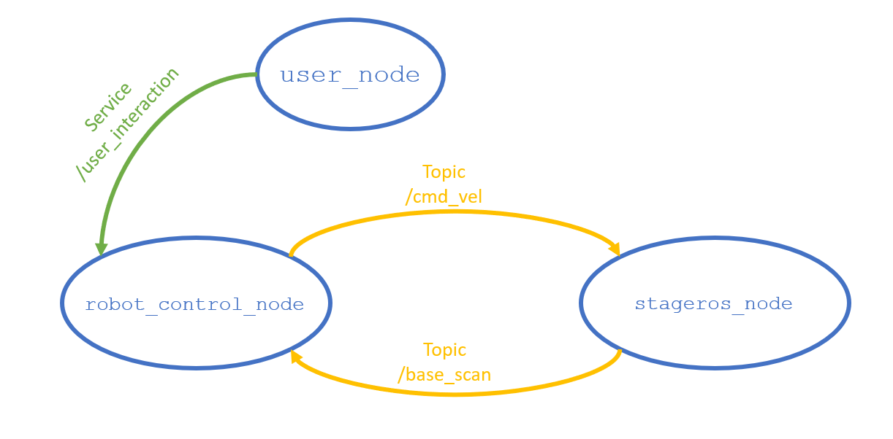

# Research Track 1: assignment n. 02
## Description of the assigment
A robot should move autonomously inside a circuit.
This robot id endowed with laser scanners.
We want to have a node for the control of the robot, and an additional node which interacts with the user to: 
- increase / decrease the speed 
- reset the robot’s position

To controlling the robot:
- we should publish a velocity on the cmd_vel topic
- can use the '/base_scan' topic to get information about the surrounding environment.
- the information about the distance of the obstacles is in the ranges vector.

The node controlling the robot should also implement the functionality for increasing / decreasing the speed as a service. Instead the user interaction node should constantly wait for an input from the user, which can either ask to increment or decrement the velocity, or to put the robot in the initial position (services already available).

## How to install and run the code
You can run the simulation environment with: 
```
rosrun stage_ros stageros $(rospack find second_assignment)/world/my_world.world
```
To run the robot control node write:
```
rosrun robot_control robot_control_node
```
And finally to run the user interface node:
```
rosrun robot_control user_node
```
Eventually exist a .launch file
```
roslaunch robot_control sa_launch.launch
```
    
## Workflow of the code
Workflow between nodes and services:



The idea is that the 'robot_control_node' gets the necessary information using the topic '/ base_scan'.
In this case the only information that is taken is the vector 'ranges' from which it is possible to know the distance of the walls from the robot, and also the angular position of the obstacles.
On the base of this information the node compute the necessary linear and angular velocity to allow the robot to move independently along the path. After doing this, the node publishes the two speeds on the topic '/cmd_vel' which assigns them to the robot.
In the meantime, the 'user_node' interacts with the user, and when the user makes a request, the node uses the '/user_interaction' service to vary the speed of the robot, or bring it back to its original position on the map.


### Linear and angular velocity
For the implemented guide, the idea is to go and look for the obstacle furthest from the robot and head in that direction by correcting the direction of the robot and calculating its speed based on the distance to the obstacles.
This means that when making a curve, the robot will slow down due to the proximity of the obstacles, and will execute the curves by changing the reference to the furthest obstacle.
The functions used to calculate linear and angular velocity may be of particular interest:
```
float linear_velocity(float ranges[]){
    define a variable for the linear velocity
    define a variable for the distansce inside the index 360 of the vector ranges
    
    velocity is computed as the moltiplication of the distance, una linear coefficent and the user coefficent:
    velocity = distance*user_coeff*liner_coeff
    
    return velocity
}
```
In this way the linear velocity decreases as the distance decreases, so that in the presence of walls the robot slows down.
The user coefficent is initially set to 1, and it increase or decrease when the user specify an desired action using the service implemented.

```
float angular_velocity(float ranges[]){
    define a variable for the angular velocity
    define a variable for the index of vector ranges which have to point the robot
    
    convert the index in an angle alpha with a specific function
    
    velocity is computed as: angular velocity = (previous angular velocity + ang_coeff) * alpha;
    
    save this angular velocity for the next step
    
    return angular velocity
}
```
The angular velocity is calculated in order to direct the robot towards the furthest obstacle, in this way the robot tries to avoid the circuit walls.
### The structure of the service
In order to interact with the user, a specific service has been created ('user_interaction.srv'),whose structure is as follows:
```
int32 user_answer
---
float32 user_coeff
```
The user_node, in this case it is the service client, while it is the robot_control_node that provides the service with the function below:
```cpp
/*
 * This function rapresent the user interaction service
 * if the request is equal to 1 the user_coeff is incremented in order to
 * increase the speed of the robot
 * if the request is equal to -1 the user_coedd is decremented in order to
 * decrease the speed of the robot
 * The response assume the value of the user_coeff
 */
bool userCoeff(second_assignment::user_interaction::Request&req, second_assignment::user_interaction::Response&res){

	if(req.user_answer ==1){
		user_coeff = user_coeff +0.1;
	}
	else if(req.user_answer == -1){
		user_coeff = user_coeff - 0.1;
	}
	
	res.user_coeff = user_coeff;
	return true;
	
}

```
The variable user_coeff is then used in the calculation of the linear velocity.

## 
**Authors:** Daria Berretta
